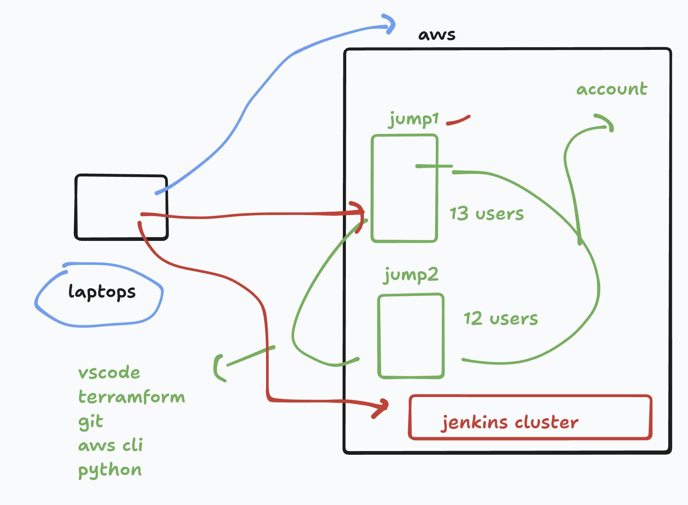

# BOA_terraform_level1_17thNov2025

## Timings 


### lab access details 



## lab users 


### checking your user code details 

```
ec2-user@ip-172-31-16-77 ~]$ sudo -i
[root@ip-172-31-16-77 ~]# 
[root@ip-172-31-16-77 ~]# su - user9 
[user9@ip-172-31-16-77 ~]$ 
[user9@ip-172-31-16-77 ~]$ whoami 
user9
[user9@ip-172-31-16-77 ~]$ pwd
/home/user9
[user9@ip-172-31-16-77 ~]$ cat .config/code-server/config.yaml
bind-addr: 0.0.0.0:8018
auth: password
password: sdfdsfdsfsdfe4a
cert: false
[user9@ip-172-31-16-77 ~]$ 

```
