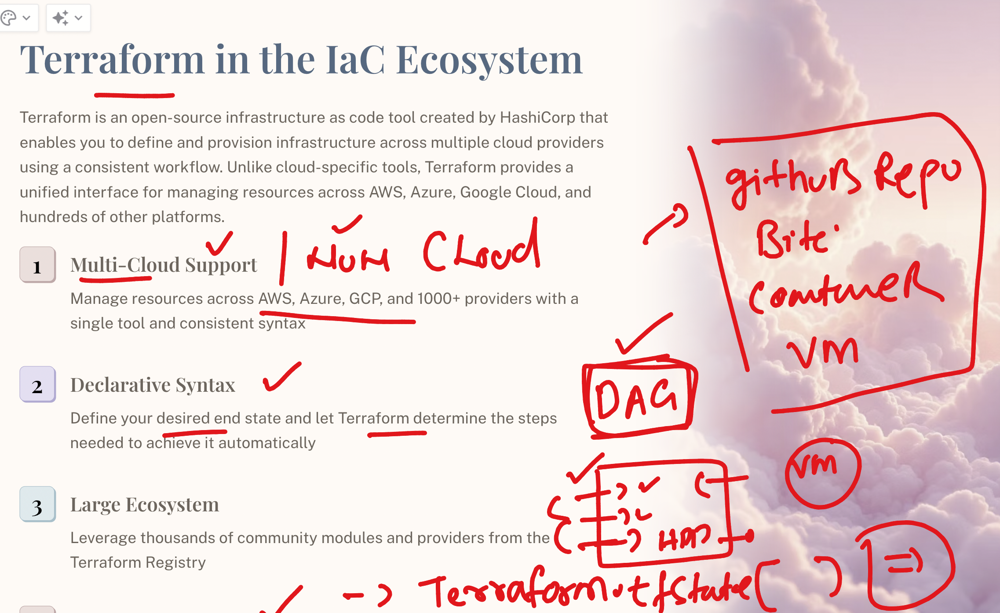

# BOA_terraform_level1_17thNov2025

### Revision info 



### doing terraform INit 

```
ec2-user@ip-172-31-16-77 ashu-project]$ cd day2-code/
[ec2-user@ip-172-31-16-77 day2-code]$ ls
outputs.tf  providers.tf
[ec2-user@ip-172-31-16-77 day2-code]$ terraform  init 
Initializing the backend...
Initializing provider plugins...
- Finding latest version of hashicorp/aws...
- Installing hashicorp/aws v6.21.0...
- Installed hashicorp/aws v6.21.0 (signed by HashiCorp)
Terraform has created a lock file .terraform.lock.hcl to record the provider
selections it made above. Include this file in your version control repository
so that Terraform can guarantee to make the same selections by default when
you run "terraform init" in the future.


====> .terraform directory 

ls  -a
.  ..  .terraform  .terraform.lock.hcl  outputs.tf  providers.tf


[ec2-user@ip-172-31-16-77 day2-code]$ tree .terraform
.terraform
└── providers
    └── registry.terraform.io
        └── hashicorp
            └── aws
                └── 6.21.0
                    └── linux_amd64
                        ├── LICENSE.txt
                        └── terraform-provider-aws_v6.21.0_x5

```

### replace variable default values in terraform plan 

```
terraform  plan   -var  machine_size="t2.small"   -var vm_name="ashutoshh-vmm"

Terraform used the selected providers to generate the following execution plan. Resource actions are indicated with the following
symbols:
  + create

Terraform will perform the following actions:

  # aws_instance.example will be created
  + resource "aws_instance" "example" {
      + ami                                  = "ami-0cae6d6fe6048ca2c"
      + arn                                  = (known after apply)
      + associate_public_ip_address          = (known after apply)

```
### passing tfvars file 

```
terraform  plan    -var-file  myvar-values.tfvars
terraform  apply    -var-file  myvar-values.tfvars
```

### updating here 

```
terraform init -upgrade
Initializing the backend...
Initializing provider plugins...
- Finding latest version of hashicorp/local...
- Finding hashicorp/aws versions matching "6.21.0"...
- Installing hashicorp/local v2.6.1...
- Installed hashicorp/local v2.6.1 (signed by HashiCorp)
- Using previously-installed hashicorp/aws v6.21.0
Terraform has made some changes to the provider dependency selections recorded
in the .terraform.lock.hcl file. Review those changes and commit them to your
version control system if they represent changes you intended to make.

Terraform has been successfully initialized!

You may now begin working with Terraform. Try running "terraform plan" to see
any changes that are required for your infrastructure. All Terraform commands
should now work.

If you ever set or change modules or backend configuration for Terraform,
rerun this command to reinitialize your working directory. If you forget, other
commands will detect it and remind you to do so if necessary.
[ec2-user@ip-172-31-16-77 day2-code]$ tree .terraform
.terraform
└── providers
    └── registry.terraform.io
        └── hashicorp
            ├── aws
            │   └── 6.21.0
            │       └── linux_amd64
            │           ├── LICENSE.txt
            │           └── terraform-provider-aws_v6.21.0_x5
            └── local
                └── 2.6.1
                    └── linux_amd64
                        ├── LICENSE.txt
                        └── terraform-provider-local_v2.6.1_x5

9 directories, 4 files
[ec2-user@ip-172-31-16-77 day2-code]$ terraform apply 
aws_instance.example: Refreshing state... [id=i-0c0d6dbdad749d08c]

Terraform used the selected providers to generate the following execution plan. Resource actions are indicated with the following
symbols:
  + create

Terraform will perform the following actions:

  # local_file.ashu-file will be created
  + resource "local_file" "ashu-file" {
      + content              = "54.234.251.85"
      + content_base64sha256 = (known after apply)
      + content_base64sha512 = (known after apply)
      + content_md5          = (known after apply)
      + content_sha1         = (known after apply)
      + content_sha256       = (known after apply)
      + content_sha512       = (known after apply)
      + directory_permission = "0777"
      + file_permission      = "0777"
      + filename             = "./myip.txt"
      + id                   = (known after apply)
    }

Plan: 1 to add, 0 to change, 0 to destroy.

Do you want to perform these actions?
  Terraform will perform the actions described above.
  Only 'yes' will be accepted to approve.

  Enter a value: yes

local_file.ashu-file: Creating...
local_file.ashu-file: Creation complete after 0s [id=d265546d8626b1b1d7ffe37de03a627853d15674]

Apply complete! Resources: 1 added, 0 changed, 0 destroyed.

Outputs:

my-vm-public-ip = "54.234.251.85"

```
## tfstate file to remote location 


### migrating remote s3 of terraform tfstate file 

```
terraform  init -migrate-state 
Initializing the backend...
Backend configuration changed!

Terraform has detected that the configuration specified for the backend
has changed. Terraform will now check for existing state in the backends.


Successfully configured the backend "s3"! Terraform will automatically
use this backend unless the backend configuration changes.
Initializing provider plugins...
- Reusing previous version of hashicorp/local from the dependency lock file
- Reusing previous version of hashicorp/aws from the dependency lock file
- Using previously-installed hashicorp/local v2.6.1

```
## basic understanding of git repo clone process


### cloing git repo to local env 

```
 git  clone  https://github.com/redashu/ashutoshh-boa-terraform-cicd.git
Cloning into 'ashutoshh-boa-terraform-cicd'...
remote: Enumerating objects: 3, done.
remote: Counting objects: 100% (3/3), done.
remote: Total 3 (delta 0), reused 0 (delta 0), pack-reused 0 (from 0)
Receiving objects: 100% (3/3), done.
[ec2-user@ip-172-31-16-77 ashu-project]$ ls
ashutoshh-boa-terraform-cicd  day1-code  day2-code
[ec2-user@ip-172-31-16-77 ashu-project]$ 


```
### copy code to gitrepo in local env 

```
cp -v  day2-code/*.tf  ashutoshh-boa-terraform-cicd/
cp -v  day2-code/terraform.tfvars  ashutoshh-boa-terraform-cicd/
```
