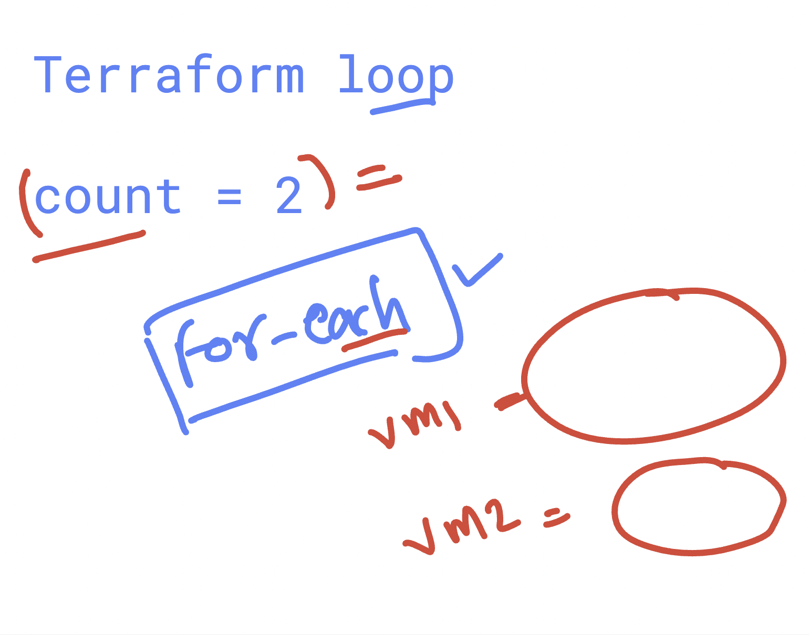

# BOA_terraform_level1_17thNov2025

### Git workflow 


### git add / commit 

```
 ls
ashutoshh-boa-terraform-cicd  day1-code  day2-code
[ec2-user@ip-172-31-16-77 ashu-project]$ cd  ashutoshh-boa-terraform-cicd/
[ec2-user@ip-172-31-16-77 ashutoshh-boa-terraform-cicd]$ ls
README.md  data.tf  ec2.tf  outputs.tf  providers.tf  security-groups.tf  terraform.tfvars  variables.tf
[ec2-user@ip-172-31-16-77 ashutoshh-boa-terraform-cicd]$ 
[ec2-user@ip-172-31-16-77 ashutoshh-boa-terraform-cicd]$ git add  .
[ec2-user@ip-172-31-16-77 ashutoshh-boa-terraform-cicd]$ git commit  -m "updating terraform"
[master a98b121] updating terraform
 Committer: EC2 Default User <ec2-user@ip-172-31-16-77.ec2.internal>
Your name and email address were configured automatically based
on your username and hostname. Please check that they are accurate.
You can suppress this message by setting them explicitly. Run the
following command and follow the instructions in your editor to edit
your configuration file:

    git config --global --edit

After doing this, you may fix the identity used for this commit with:

    git commit --amend --reset-author

 2 files changed, 19 insertions(+)
 create mode 100644 data.tf
 create mode 100644 security-groups.tf

 ```
 ## understanding cicd 

 

 ### auto trigger job 

  

### creating multi branches git repo so that we can maintain code to multi env like  dev , uat , and prod 

```
 git branch 
* master
[ec2-user@ip-172-31-16-77 ashutoshh-boa-terraform-cicd]$ git  checkout -b  dev 
Switched to a new branch 'dev'
[ec2-user@ip-172-31-16-77 ashutoshh-boa-terraform-cicd]$ git branch 
* dev
  master
[ec2-user@ip-172-31-16-77 ashutoshh-boa-terraform-cicd]$ 

```
### switching of branches 

```
[ec2-user@ip-172-31-16-77 ashutoshh-boa-terraform-cicd]$ git switch  master 
Switched to branch 'master'
Your branch is up to date with 'origin/master'.
[ec2-user@ip-172-31-16-77 ashutoshh-boa-terraform-cicd]$ git branch 
  dev
* master
[ec2-user@ip-172-31-16-77 ashutoshh-boa-terraform-cicd]$ git switch dev 
Switched to branch 'dev'
[ec2-user@ip-172-31-16-77 ashutoshh-boa-terraform-cicd]$ git branch 
* dev
  master
[ec2-user@ip-172-31-16-77 ashutoshh-boa-terraform-cicd]$ 

```
### pushing to dev branch 

```
333  git add .
  334  git commit  -m "updating dev branch with jenkinsfile"
  335  history 
  336  git push origin dev 

```
### creating antoher branch 

```
[ec2-user@ip-172-31-16-77 ashutoshh-boa-terraform-cicd]$ git  branch 
* dev
  master
[ec2-user@ip-172-31-16-77 ashutoshh-boa-terraform-cicd]$ git switch  master 
Switched to branch 'master'
Your branch is up to date with 'origin/master'.
[ec2-user@ip-172-31-16-77 ashutoshh-boa-terraform-cicd]$ git  checkout -b  prod 
Switched to a new branch 'prod'
[ec2-user@ip-172-31-16-77 ashutoshh-boa-terraform-cicd]$ git branch 
  dev
  master
* prod
[ec2-user@ip-172-31-16-77 ashutoshh-boa-terraform-cicd]$ 

```

### for each concept 


